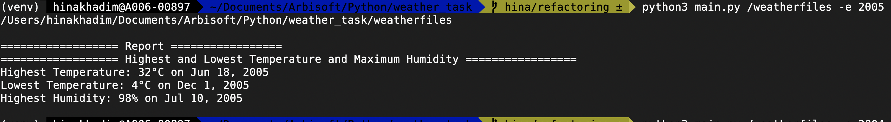
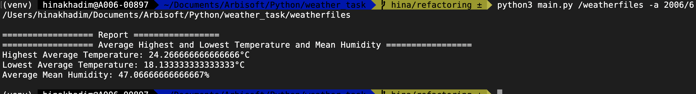
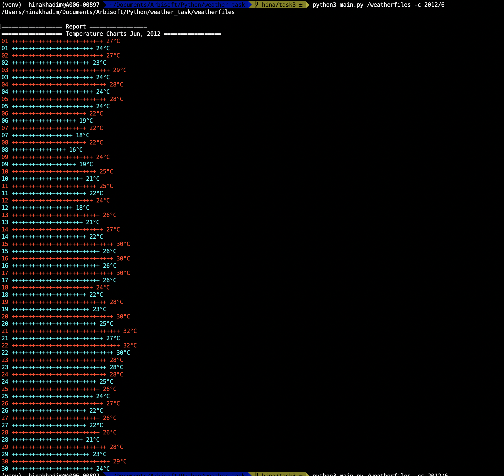
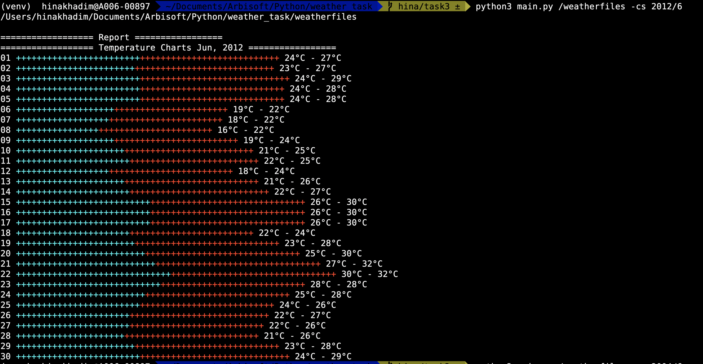

## Weather Task


### How to Run:


> For Question 1:
```bash

python3 main.py /path-to-files -e {year}

ex: 
`python3 main.py /weatherfiles -e 2005`

```

> For Question 2:
```bash

python3 main.py /path-to-files -a {year}/{month_number}

ex: 
`python3 main.py /weatherfiles -a 2006/6`

```


> For Question 3:
```bash
python3 main.py /path-to-files -c {year}/{month_number}

ex: 
`python3 main.py /weatherfiles -c 2005/3`

```


> For Question 4:
```bash

python3 main.py /path-to-files -e {year} -a {year}/{month} -c {year}/{month}

ex: 
`python3 main.py /weatherfiles -c 2009/5 -e 2005 -a 2014/4`

```


> For Question 5:
```bash

python3 main.py /path-to-files -cs {year}/{month_number}

ex: 
`python3 main.py /weatherfiles -cs 2005/8`
# c --> charts, s --> single line
```


### Code Output:

#### 1- High Temperature, Low Temperature and Humidity



<br />

#### 2- Average Highest Temperature, Average Lowest Temperature and Average mean Humidity



<br />

#### 3- Charts for Highest Temperature and Lowest Temperature on Each day



<br />

#### 4- Multiple Reports

This task is long on terminal, so can't capture a image

<br />

#### 5- Charts for Highest Temperature and Lowest Temperature on Each day in One line



<br />


Code works in the following way:

1. Receive the date values from user 
2. pass the values to `report_generator` file which done the whole flow of generating report.
    - For a single report, the first step is that it passes all the files of folder to the `file_path_matcher_with_date` file which returns the **files path which contains the date which the user has provided** to the `report_generator` file
    - After receiving paths, the matched file paths are send to the `weather statistics_calculator` file along with date, which then reads the records from file paths and saved in the Storage. After storing the records in a data structure, it performs the desired calculations on it. For example, if user want average low, high temperature and mean humidity, the function calculates that from the stored records and produces the output.
    - The result is called `report data` and returns to the `report_generator` file, when the calculations are performed.
    - The `report_data` is then passed to the `report_template` file, in which the date is populated into the corresponding template function and it prints the report.
3. For every flag, the same procedure is going on.